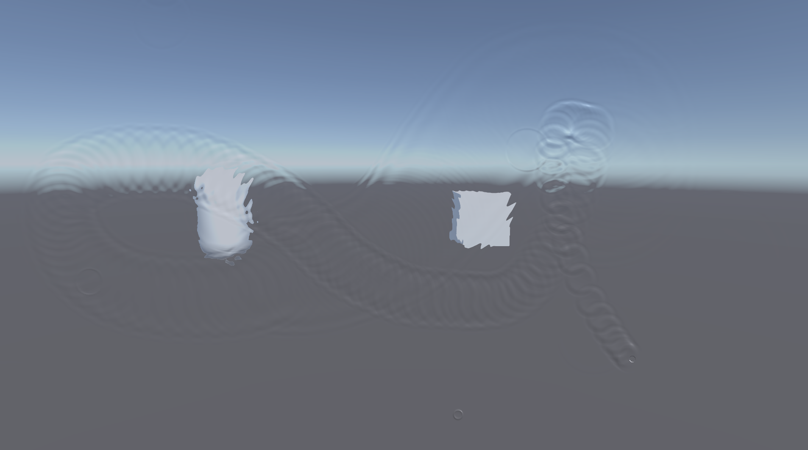

# Unity-Wave-Propagation

The shader code is converted from [Wave Propagation Effect](https://www.shadertoy.com/view/Xsd3DB) created by [tomkh](https://www.shadertoy.com/user/tomkh) and [Finite Water
](https://www.shadertoy.com/view/4sd3WB) created by [overlii](https://www.shadertoy.com/user/overlii) on Shadertoy.

If you want to deactivate the mouse interaction, just hit the spacebar.

Video on YouTube(https://youtu.be/rK5AAb-1pgE)

## Note

> Note that for now it only supports limited resolutions and may not work well in editor.

> 請注意，目前只支援特定解析度，且可能在Editor介面中行為有點怪(Build出來沒有問題)